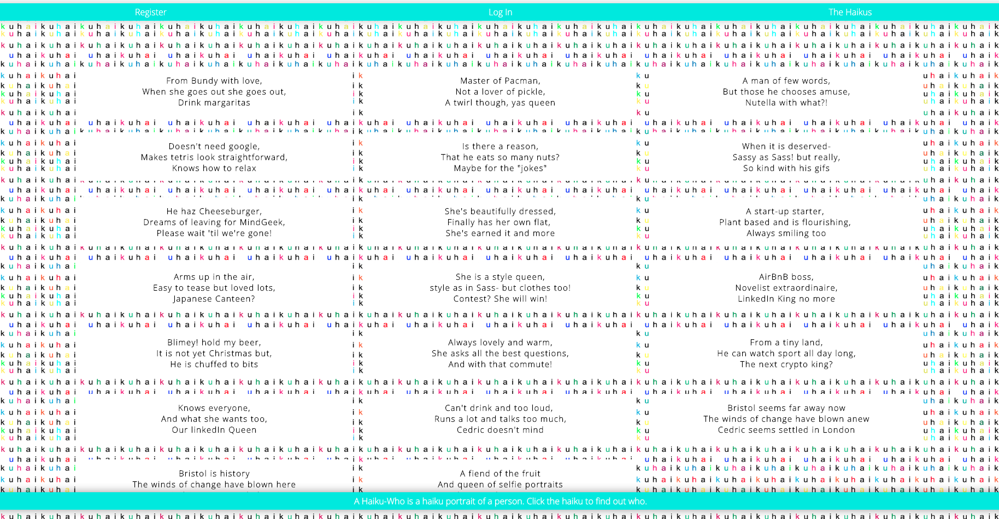
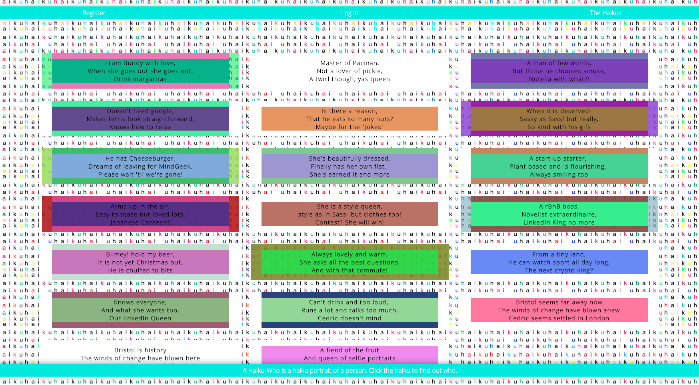
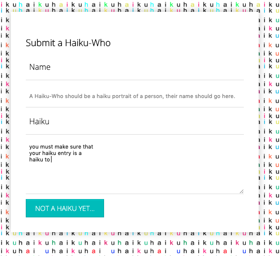
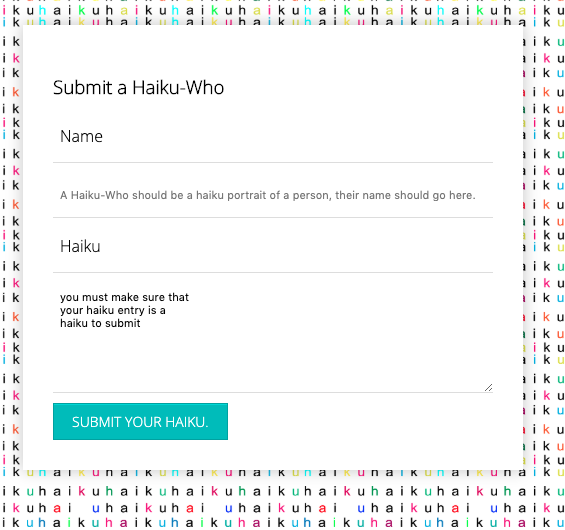

# Haiku-Who? (a weekend extra)

### Technical Requirements

Over the course of a week we were given this brief, we were told that we must create a Python/Flask backend that must:

* **Include at least one Model** -
* **Be able to perform full CRUD actions** -
(Create, Read, Update, Delete)
* **Include a seeds file**

I then decided to set myself the extra task of adding a frontend over the weekend.

So the final step...

* **Add a front-end** and deploy the app, making it accessible to the public.




## Built using

||||
|--- |--- |--- |
|React|JavaScript(ES6)|SCSS|
|Flask|postgreSQL|SQLAlchemy
|Pipenv|Webpack|Yarn
|bcrypt|jsonwebtoken|axios
|body-parser|file-loader|Python


## Deployment

The app is deployed on Heroku and it can be found here: https://haiku-who.herokuapp.com/

## Getting Started and How It Work

If you would like to download this repository and run the code yourself simply click to "clone" and then in the terminal enter the following commands:


```
<!-- to install JavaScript Packages: -->
$ yarn
<!-- to install Python packages: -->
$ pipenv
<!--Then to seed the database: -->
$ pipenv run python seeds.py
<!-- Run the frontend in your localhost: -->
$ yarn serve:react
<!-- Run the backend in your localhost: -->
$ yarn serve:flask
```

When you have registered and logged in you will find that you are able to view "The Haiku-Whos" Each Haiku-Who is a portrait of a person (members of my class!) and you can click the haiku to find out who.



(they also, in a totally stylish and non-OTT way, magically change colour on mouseOver)


### The Models and Controllers

This was a very simple database with only two (very simple) models- haikus and users. I have added a comment schema with the idea in mind that I may add this functionality.


### Submitting a Haiku

The most fun bit of this project was in trying to come up with a vaguely use-able haiku checking function that would count the syllables in a submission and return true or false depending on whether the count fitted with in a designated range.

I knew from the outset that this would be pretty much impossible to do accurately as the English language just doesn't work in this way and there is no easy way to count syllables. I did my best though and then allowed quite a lot of leeway either way to try and account for errors. The button on the submit for is conditionally rendered to display differently and only work if the condition of this function is met:

```js
haikuCheck(string) {
  if(string.length > 10) {
    const vowels = ['a', 'e', 'i', 'o', 'u', 'y']
    const countOne = string.split('').reduce((count, letter) => {
      return vowels.includes(letter.toLowerCase()) ? count + 1 : count

    }, 0)
    const dubVowels = ['ee', 'ie', 'ou', 'au', 'ea', 'ei', 'oo', 'oy', 'e ', 'ai', 'yo', 'ya', 'ye', 'yi']
    const stringPair = string.match(/(..?)/g)
    const countTwo =stringPair.reduce((count, letter) => {

      return dubVowels.includes(letter.toLowerCase()) ? count - 1 : count
    }, 0)
    let stringTwo = string.substring(1)
    stringTwo = stringTwo.match(/(..?)/g)
    const countThree = stringTwo.reduce((count, letter) => {
      return dubVowels.includes(letter.toLowerCase()) ? count - 1 : count
    }, 0)
    const syllables = countOne + countTwo + countThree
    console.log(countOne,countTwo,countThree, syllables)
    if (syllables > 15 && syllables < 19) return true
  }
}
```
Before it is a haiku...



When it is a haiku...



(or close enough!)


## Challenges and Future Improvements

The haiku function was definitely a challenge but one that I thoroughly enjoyed, I am quite tempted to expand and start allowing other verse forms, I would like to try and make a "sonnet checking" function and maybe a "limerick checking" function. There is so much potential!

I probably need to work on the one that I have here first though.

Overall I had a great time doing this and I learnt a lot, it set me in good stead for my big final project for which I would be using the same technologies. 
